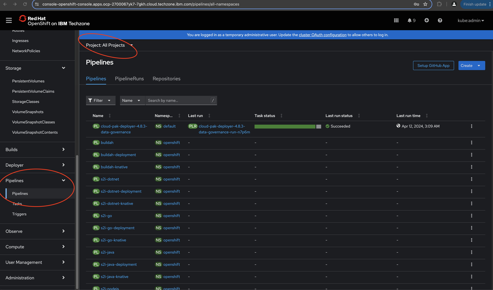
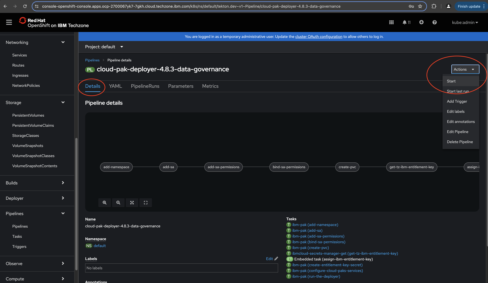
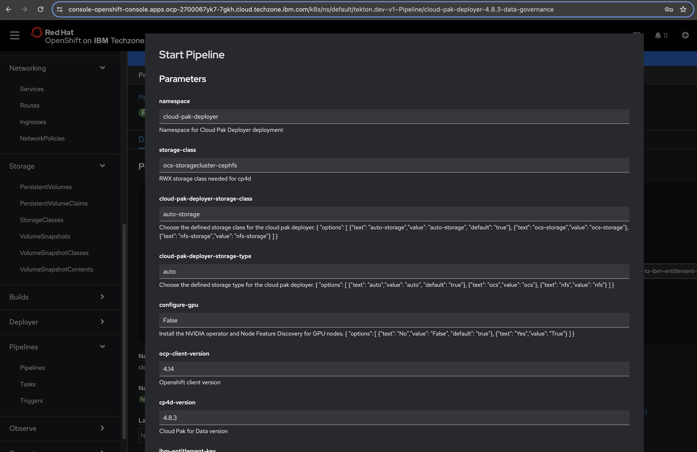
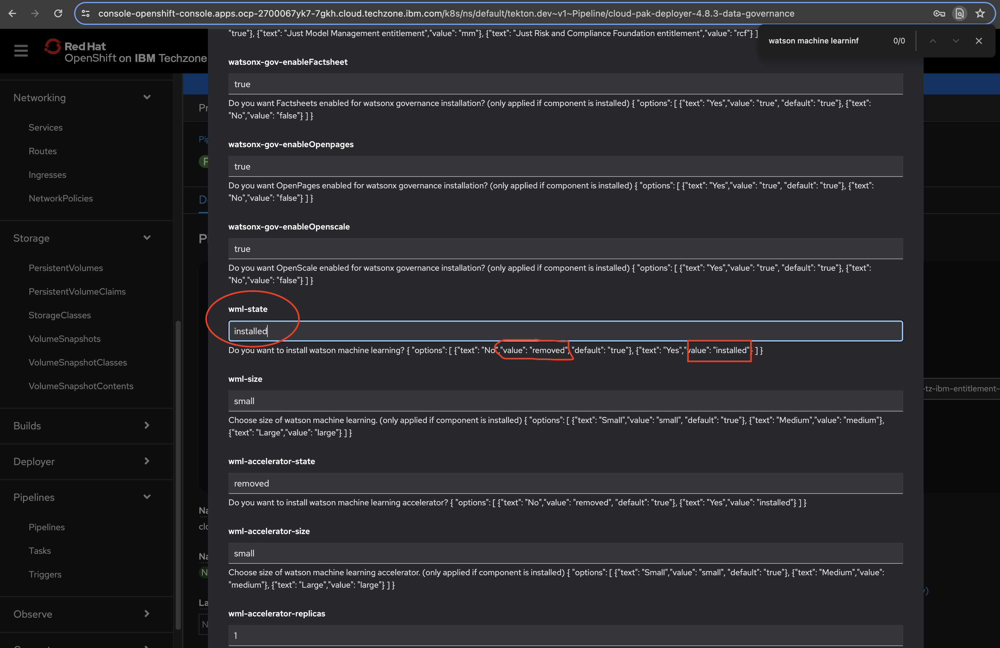
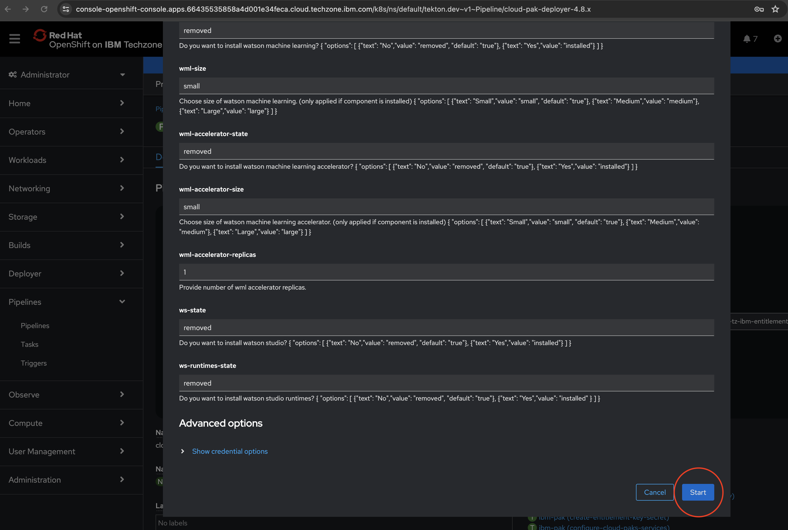
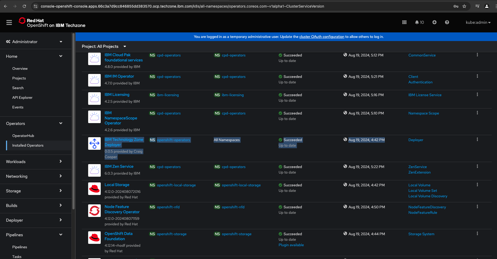
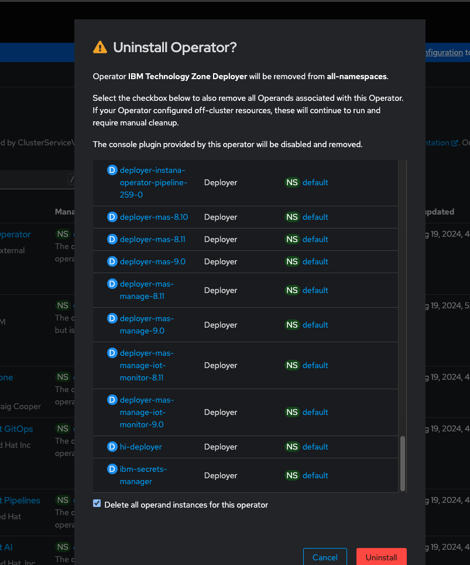
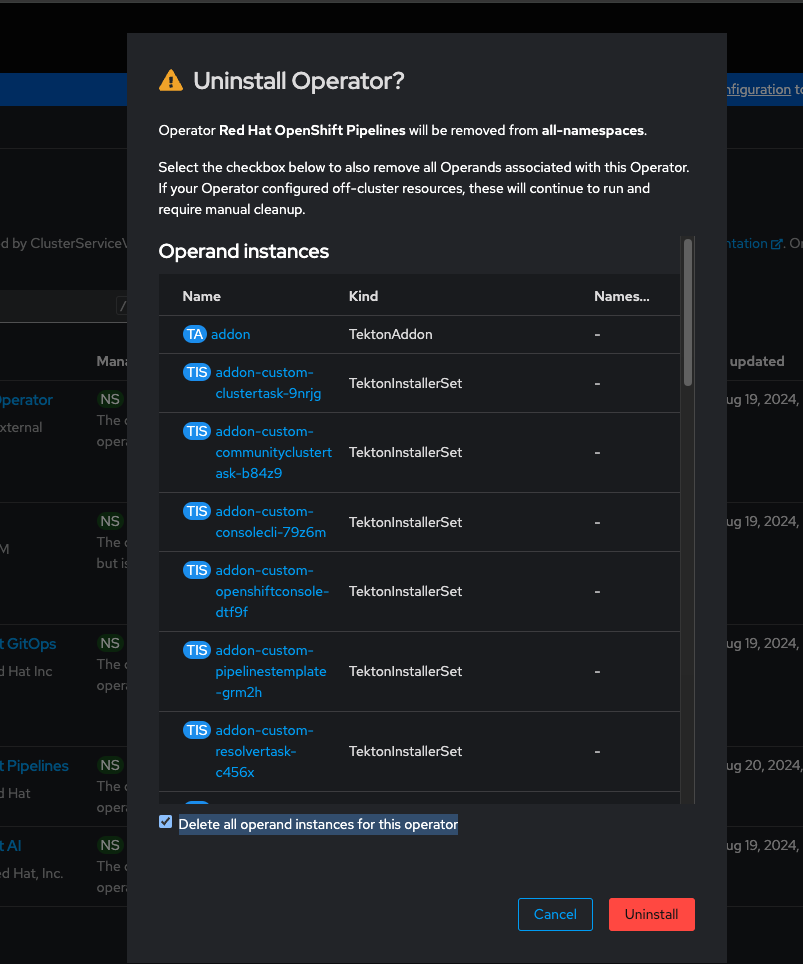
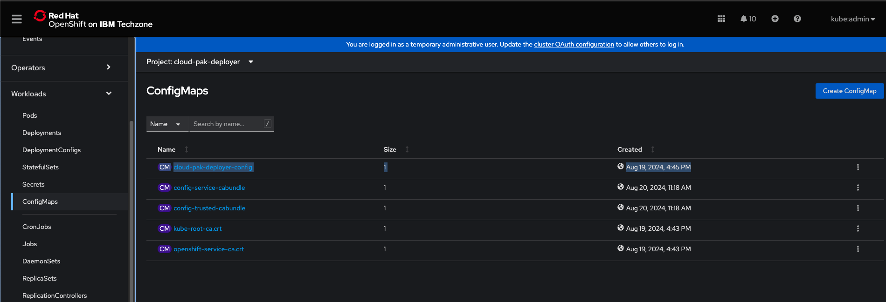
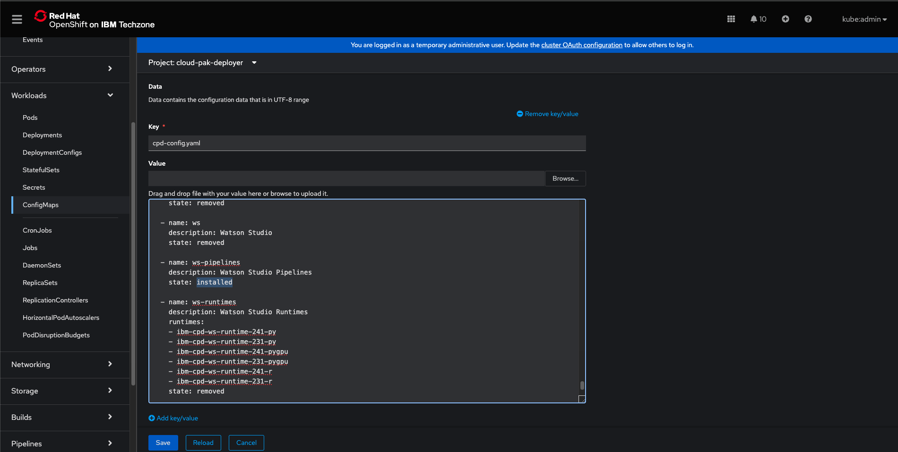

# TechZone Deployer CP4D Pipelines Runbook and FAQ

## What is in this document?

This runbook is a resource for IBM Technology Zone users who are creating reservations utilizing the TechZone Deployer asset to deploy IBM Cloud Pak for Data (CP4D) software. Examples include environments in the TechZone Certified Base Images collection that reference CP4D as pictured below:


## How are the TechZone Deployer - Cloud Pak for Data environments different?

Like all of the other [TechZone Deployer](TechZone-Deployer-FAQ.md) environments, The Cloud Pak for Data (CP4D) environments create a unique Deployer cluster and uses OpenShift Pipelines to install IBM products. What makes the Cloud Pak for Data pipelines unique is that they use the [Cloud Pak Deployer](https://ibm.github.io/cloud-pak-deployer/) in the pipeline to install CP4D.

Specifically, it uses [this method](https://ibm.github.io/cloud-pak-deployer/50-advanced/run-on-openshift/run-deployer-on-openshift-using-console/) of utilizing the Cloud Pak Deployer in an OpenShift Cluster that already exists.

# FAQs and Common Errors

### My pipeline failed to complete due to an error.

If the cluster for the reservation is successfuly provisioned but there is an error in the pipeline, record the error from the failing task, then try restarting the pipeline.

Steps to restart the pipeline with the same parameters it had when it failed:

1. Log into the cluster and from the OpenShift console select the "Pipelines" section from the left side menu.

2. Click the inner "Pipelines" section and you should be able to see the pipeline that failed.

   Note: If you don't see any pipelines you may be in the wrong project and should change the Project: \<projname\> at the top of the screen to "All Projects"

3. Click on the three dots on the right side of the screen of the failed pipeline and select "Rerun"

### I want to add more CP4D components to my cluster after the pipeline has already successfully run.

There are three ways to modify the components to your cluster after the pipeline had already completed. **Be mindful of the required memory and CPU that the additional components require as the installation will fail if the cluster is too small to install the components.**

1. You can run the pipeline again, but this time you add the additional components that you want installed.

   - This can be one of the easier methods of adding components if you aren't familiar with the [official way to install CP4D](https://www.ibm.com/docs/en/cloud-paks/cp-data/4.8.x?topic=installing), or how to use the cloud pak deployer. However, there are some common pitfalls that you need to be careful to avoid.

     - If you don't include components that are already installed on the cluster, then the Cloud Pak Deployer will actively try to uninstall them. <ins>**The Cloud Pak Deployer tries to make the cluster match the components and instances that are defined when it is run**</ins>. Be careful running the pipeline again if you created an instance after the Cloud Pak Deployer ran because <ins>**it might try to delete it**</ins>. If you have 6 components installed and try to add one more by running the pipeline with just that one component defined, then <ins>**the 6 original components will be attempted to be uninstalled**</ins>.

   - What you need to do is go to the Pipelines section on the OCP UI menu and click "Pipelines" to see the recently run pipelines. If you don't see anything, check the "Project:" text at the top of the screen and make sure it is set to "All Projects"
     

   - Then click the pipeline starting with the name "cloud-pak-deployer-..." in the "Name" section.
     

   - This will show you information about the pipeline. Go to the Details tab and then click on the "Actions" dropdown in the top right and click "Start".
     

   - This will open up a list of all the parameters and you should change the value of the components you want to install to "installed" or "True" depending on the options listed. The defaults for all components and most options is "removed" or "False". For example: if I wanted to install Watson Machine Learning, then I would change its value to installed.
     
     

   - Once you have selected all of the components that you want on the cluster after the pipeline runs, press the start button at the bottom right and it will start the pipeline.

2. You can use the Cloud Pak Deployer to install the additional components.

   - These pipelines already set up the Cloud Pak Deployer in the OpenShift cluster, so users that are already familiar with it can modify the configmap that the Cloud Pak Deployer uses to determine which components to install and then run it again.
   - For help with this method you will need to use support and documentation found on [the Cloud Pak Deployer documentation site](https://ibm.github.io/cloud-pak-deployer/50-advanced/run-on-openshift/run-deployer-on-openshift-using-console/). If you are an IBMer you can also use their internal slack channel [#cloud-pak-deployer-users](https://ibm.enterprise.slack.com/archives/C02GQMJA8JJ), but the slack channel is only abailable to IBM employees.

3. You can install the components following [the official instructions](https://www.ibm.com/docs/en/cloud-paks/cp-data/4.8.x?topic=installing)

### I want to create a reuseable component configuration so that I don't have to always change the pipeline values in the UI.

The CP4D pipeline and pipeline run code are located in there own public repo at https://github.com/cloud-native-toolkit/deployer-cloud-pak-deployer and [this is a link](https://github.com/cloud-native-toolkit/deployer-cloud-pak-deployer/tree/main/cp4d/4.8.x) to the pipeline and pipelinerun used in the CP4D 4.8.4 reservation.

As long as you are using a TechZone created Deployer cluster, you can create/apply the pipeline and pipelinerun files in the cluster to start the pipeline manually with a pre-defined configuration of components.

Pictured below, there are commented out values for many of the components that can be uncommented in order to be applied to the cluster when the pipelinerun is created.

Those familiar with the Cloud Pak Deployer will recognize the values for the parameters match the values that you would define in the Cloud Pak Deployer's config map. You can search the pipeline file for the component you want to add to see what its parameter name should be in the pipelinerun.

### I'm having a problem that re-running the pipeline didn't fix.

The TechZone Deployer and Cloud Pak Deployer are only two pieces of the reservation deployment process, and it will save you time if you contact the right people for the problem you are experiencing.

If you are having problems with the cluster in general (reservation failed to be created, storage not working correctly, nodes are not to the correct specifications, ect.), create a support case.

If there is a problem with the CP4D Pipeline that re-running the pipeline didn't fix, then create a support case. Be sure to include the name of the pipeline and any relevant information like errors, warnings, and what components you were trying to install.

Information for creating a support case can be found in the ["Help" section of the IBM Technology Zone on the right side](https://techzone.ibm.com/help).

If you are having problems installing demos or running scripts from people outside of the IBM Technology Zone, then reach out to the owners of those demos or scripts. We can't help everyone debug every issue from custom resources, but if there is something wrong with the way our automation configured the IBM product it depends on, the owners of the demo/script will be the best able to work with us to fix it.

### I'm trying to install Watson Pipelines but the pipeline doesn't have an option for it.

Watson Pipelines is incapable of exisiting on a cluster that already has OpenShift Pipelines installed. OpenShift Pipelines is required for the TechZone Deployer's pipelines to function.

This is a failure of the product that the product team has stated there is no timeline to fix. If you need to install it on the cluster, first uninstall the TechZone Deployer operator and the OpenShift Pipelines operator, then install Watson Pipelines using [the official instructions for installing Watson Pipelines](https://www.ibm.com/docs/en/cloud-paks/cp-data/4.8.x?topic=pipelines-installing) or the [Cloud Pak Deployer](https://ibm.github.io/cloud-pak-deployer/).

Below are step-by-step instructions for uninstalling the the TechZone Deployer operator and the OpenShift Pipelines operator, as well as guidance for running the cloud pak deployer afterwards to install Watson Studio Pipelines. Once the TechZone Deployer and OpenShift Pipelines are uninstalled you will no longer be able to run any TechZone Deployer pipelines, so be sure that you've installed everything else that you want before doing this.

1. Go to the installed operators section of the UI in OpenShift and find the TechZone Deployer Operator.


2. Click the three dots on the right and select "Uninstall Operator"  
**When given the option, click the checkbox to "Delete all operand instances for this operator"**




3. Confirm that you want to uninstall it and then wait for the OpenShift Pipelines operator to stop updating. It should take ~3 to 5 minutes as the Deployer Operator locks OpenShift Pipelines to a specific version, so once it is uninstalled the OpenShift Pipelines Operator will automatically attempt to update to the latest version.

**DO NOT UNINSTALL OPENSHIFT PIPELINES WHILE IT IS STILL UPDATING** - this will leave remnants in the cluster that will be hard to manually remove later.

4. Once OpenShift Pipelines is done updating, uninstall the operator the same way as before. Click the three dots on the right and select "Uninstall Operator" and click the checkbox to "Delete all operand instances for this operator" 



5. Once the OpenShift Pipelines operator is uninstalled, go to the cloud pak deployer's configmap named "cloud-pak-deployer-config" located in the cloud-pak-deployer project.


6. Edit the configmap to change the value of ws_pipelines from "removed" to "installed" and save the change.




7. Click the plus button on the top right of the screen in the OpenShift UI and paste the following yaml from [the cloud pak deployer documentation](https://ibm.github.io/cloud-pak-deployer/10-use-deployer/3-run/existing-openshift-console/#start-the-deployer).

```
apiVersion: v1
kind: Pod
metadata:
  labels:
    app: cloud-pak-deployer-start
  generateName: cloud-pak-deployer-start-
  namespace: cloud-pak-deployer
spec:
  containers:
  - name: cloud-pak-deployer
    image: quay.io/cloud-pak-deployer/cloud-pak-deployer:latest
    imagePullPolicy: Always
    terminationMessagePath: /dev/termination-log
    terminationMessagePolicy: File
    command: ["/bin/sh","-xc"]
    args: 
      - /cloud-pak-deployer/scripts/deployer/cpd-start-deployer.sh
  restartPolicy: Never
  securityContext:
    runAsUser: 0
  serviceAccountName: cloud-pak-deployer-sa
  ```


8. Once you click the create button at the bottom left it will kick off the creation of the new cloud pak deployer pods where you can watch the logs to see if the install is successful. Because you are no longer using the TechZone supported installation process, questions/issues about the cloud pak deployer may best be answered in the #cloud-pak-deployer-users slack channel.


## TechZone Deployer SMEs

[David Massey](mailto:david.massey@ibm.com), [David Stacy](mailto:david.stacy@ibm.com), [Cong Nguyen](mailto:cong.nguyen@au1.ibm.com), [Craig Cooper](mailto:craig.cooper@ibm.com)
