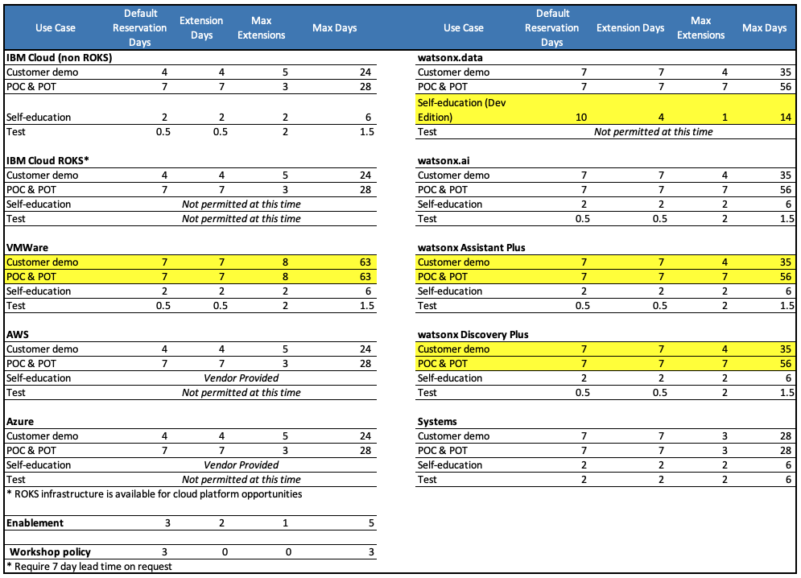

# IBM Technology Zone Reservation Duration Policies

## Summary

This Documentation contains information regarding reservation duration policies for IBM Technology Zone environments based on the Infrastructure of the environment and the purpose in which the environment is being reserved for. This includes details for the length of time that can be requested up front for the environment with information on length of time allowed with extensions. 

## Table of Contents

• [Duration Policies](https://github.com/IBM/itz-support-public/blob/main/IBM-Technology-Zone/IBM-Technology-Zone-Runbooks/reservation-duration-policy.md#duration-policies)

• [Quota Policies](https://github.com/IBM/itz-support-public/blob/main/IBM-Technology-Zone/IBM-Technology-Zone-Runbooks/reservation-duration-policy.md#quota-policies)

• [Workshop Policies](https://github.com/IBM/itz-support-public/blob/main/IBM-Technology-Zone/IBM-Technology-Zone-Runbooks/reservation-duration-policy.md#workshop-manager-policies)

## Duration Policies

Reservation duration policies are the length of time allowed to reserve an environment on a reservation form with additional insight into the length of time allowed to extend a reservation as well. Reference information below to learn about the current reservation duration policies in place today and where on the reservation form experience to look for these duration policies live.

### Current Policies as of April 1st, 2024:
Recent changes are highlighted below in chart.

- VMWare environments reserved with Customer Demo and Proof-of-Technology have increased durations
- watsonx Customer Demo and POCs have increased durations
- watsonx.data developer now allow education reservations

**Definitions:**
- Vendor Provided: Self-education resources are accesible through the respective 3rd-party platform

**Use Case:** The infrastructure of the environment being reserved broken down by the purpose in which the environment is being used for. This information is captured on the reservation form to determine the duration policy per reservation. 

**Default Reservation Days:** On the reservation form, this duration is the default amount of time, pre-selected, on the end date field. 

**Extension Days:** After a reservation has been created with the initial default reservation days (per above), leverage the self-service extension option to extend for this length of time. 

**Max Extensions:** The total number of extensions allowed for the reservation. 

**Max Days:** Total time the environment can be reserved if all extensions are used.

## Duration Policies Displayed On Every Reservation Form

Duration policies can be found on every TechZone environment reservation form directly below the end date field. This helper text below the date picker field will explain in detail the default recommended duration for the reservation being created with further guidance on the amount of time allowed per extension and how many extensions this reservation will have. If all extensions are used, as stated in the helper text the total amount of time that the environment can be reserved for is provided as additional guidance.

**NOTE:** Client facing purpose reservations (Customer Demo, Proof of Concept, Proof of Technology) have policies in place today to provide more time to those that are reserving environment for client demonstrations.

## Workshop Manager Policies

Workshop Manager requests must be submitted minimally **7** days before the intended start date of the workshop engagement. Submitting requests earlier than the 7 day lead time is highly encouraged. This 7 day lead time on requests allows for the IBM Technology Zone team to prepare, review, and allocate resources to support our user's workshop environment needs.

For requests that exceed the max duration of **3** working days and max of **30** environments being requested, an exception request is required for further executive approval. 

Follow the steps below for exception request process: 
1. Schedule your workshop with the requested duration and total number of environments needed
2. Log a Support case using TechZone [webform](https://ibmsf.force.com/ibminternalproducts/s/createrecord/NewCase?language=en_US) or send an email to Techzone.help@ibm.com with the following information provided: 
- Subject/Title: Workshop Manager extension exception request
- Provide Workshop name and URL
- Provide information on if this workshop is external or internal workshop
  
  **External workshops** are tied to an engagement with a customer and a valid IBM Sales Cloud opportunity code should be provided
  
  **Internal workshops** are tied to an internal IBM go-to-market teams enablement and the IBM Group/Team name should be provided
  
- Provide additional business justification for needing this extension

## Quota Policies

A reservation quota policy contains predefined restriction for users making reservations on IBM Technology Zone. Quota policies are in place to ensure appropriate allocation of resources and prevent overutilization. Leverage the information below to understand current reservation quota policies in place today and how we will notify you on the reservation form experience if you are violating a quota policy. 

### Current Quota Policies as of August 25th, 2023:

Self-Education Quota Policy = Maximum 2 "Practice / Self-Education" reservation(s) permitted at a time per user.

### Quota Policy Violations

Quota policy violation notices are triggered from the reservation form when users make a reservation that violate an existing quota policy. Every notice will include the quota policy that was violated along with the associated reservation ID's. 

_**IMPORTANT:**_ There are no exceptions to quota policies at this time.

Additional Guidance: 

- Failed reservation statuses do not count against your existing quota.

- If you made a self-education reservation and it failed, please provision a new instance. 

- A net new self-education reservation can NOT be scheduled in advance if you have two existing reservations. You can delete one or wait for one or both to expire before making the next self-education reservation.
  

### Support

Log a support case: [https://ibmsf.force.com/ibminternalproducts](https://ibmsf.force.com/ibminternalproducts)
